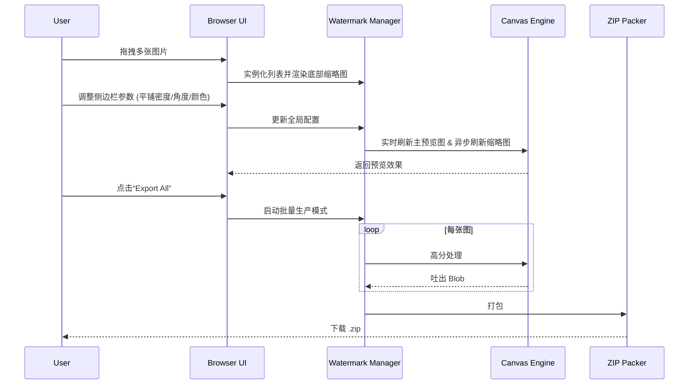

# Product Requirement Document (PRD) - Image Watermarking Tool (Web)

## 1. 产品路线图 (Product Roadmap)

### 核心目标 (Mission)
打造一款极致简约、美观且高效的 Web 批量图片水印处理工具，让水印添加从“繁琐工作”变为“艺术创作”。

### 用户画像 (Persona)
*   **社交媒体创作者**：需要快速给多张图片加防盗水印/品牌 logo。
*   **私域运营者**：批量为产品图增加联系方式。
*   **普通用户**：临时需要给证件照等敏感图片批量覆盖全屏水印（Privacy First）。

### V1: 最小可行产品 (MVP)
*   **[Core] 批量上传与预览**：支持多图拖拽上传，底部实时滚动预览。
*   **[Layout] 全屏平铺 (Full-screen Tile)**：支持水印文字斜向平铺整张图片，可调节密度、角度、透明度。
*   **[Style] 高级样式**：自定义文字、颜色选择、字体大小、旋转。
*   **[Output] 批量打包下载**：浏览器本地处理，一键导出 ZIP。
*   **[UI] Hybrid Minimalist**：大图实时预览 + 侧边配置 + 底部多图滚动效果卡片。

### V2 及以后版本 (Future Releases)
*   **图形水印 (Image Logo)**：上传 PNG 作为水印。
*   **艺术边框 (Creative Borders)**：增加拍立得、极简相框效果。
*   **智能排练 & 云端模板**。

---

## 2. 关键业务逻辑 (Business Rules)
*   **隐私优先**：所有 Canvas 处理均在本地完成。
*   **响应式平铺**：平铺间距随图片长宽比自动适配。

## 3. 数据契约 (Data Contract)
```json
{
  "watermarkConfigs": {
    "text": "string",
    "color": "hex",
    "fontSize": "number",
    "opacity": "number",
    "rotate": "degree",
    "mode": "tile | single",
    "density": "number"
  },
  "images": "File[]"
}
```

---

## 4. MVP 原型设计 (Selected: A + C Hybrid)

### 设计说明
*   **顶部/中部**：沿用方案 A 的简洁布局，左侧为当前选中的主图预览，右侧为精细化控制面板。
*   **底部**：引入方案 C 的卡片流，显示所有上传图片的缩略图及已应用水印后的效果，点击可切换为主图。

### ASCII 原型图
```text
+-------------------------------------------------------------+
| [LOGO] WatermarkArt                          (Settings) (Help) |
+-------------------------------------------------------------+
|                                                             |
|  +---------------------------+  +--------------------------+  |
|  |    Active Preview (Big)   |  |      Configuration       |  |
|  |                           |  |                          |  |
|  |   +-------------------+   |  |  Content: [__________]   |  |
|  |   |                   |   |  |                          |  |
|  |   |     Image with    |   |  |  Mode: [ Tile ] [Single] |  |
|  |   |     Watermarks    |   |  |  |                          |  |
|  |   |                   |   |  |  Density: --o----------  |  |
|  |   +-------------------+   |  |  Angle:   ---o---------  |  |
|  |                           |  |  Color:   [ #FFFFFF ]    |  |
|  +---------------------------+  +--------------------------+  |
|                                                             |
|  +---------------------------------------------------------+  |
|  |  Batch Preview (Bottom Strip)                           |  |
|  |  +-------+  +-------+  +-------+  +-------+  +-------+  |  |
|  |  | IMG1  |  | IMG2  |  | IMG3  |  | IMG4  |  |  [+]  |  |  |
|  |  | (done)|  | (done)|  | (edit)|  | (wait)|  | (add) |  |  |
|  |  +-------+  +-------+  +-------+  +-------+  +-------+  |  |
|  |                                                         |  |
|  |  [ Export All as ZIP ]             [ Clear All ]        |  |
|  +---------------------------------------------------------+  |
|                                                             |
+-------------------------------------------------------------+
```

---

## 5. 架构设计蓝图

### 核心流程图


### 组件交互说明
*   `Index.html`: 骨架结构，使用 CSS Grid 构建 A+C 布局。
*   `WatermarkManager.js`: 核心逻辑库，维护图片队列和配置对象。
*   `CanvasRenderer.js`: 专注于 Canvas 绘图逻辑（单次渲染、平铺渲染）。
*   `Style.css`: 现代极简风格，使用 CSS Variables 方便主题切换。

### 技术选型与风险
*   **选型**：Pure JS + Canvas API + JSZip。
*   **风险**：
    *   **内存**：建议同时处理图片不超过 50 张，或分块处理，避免浏览器崩溃。
    *   **字体**：Web Font 加载可能存在延迟导致 Canvas 开始时没抓到样式。
